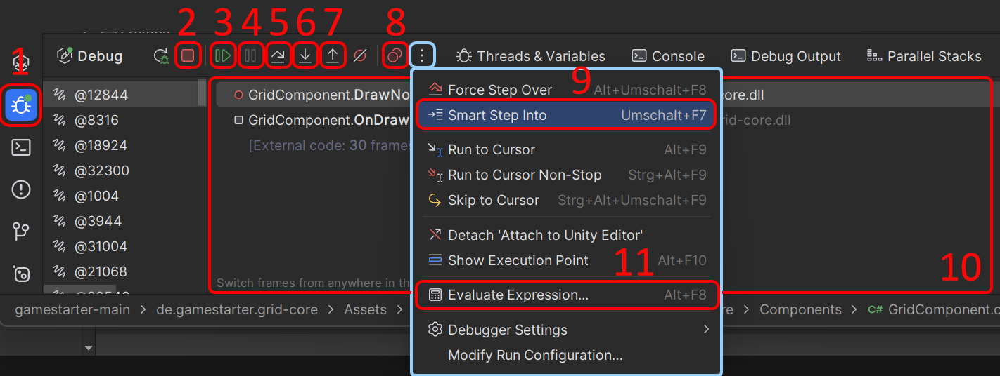
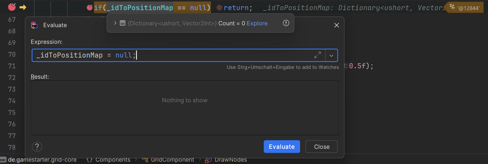
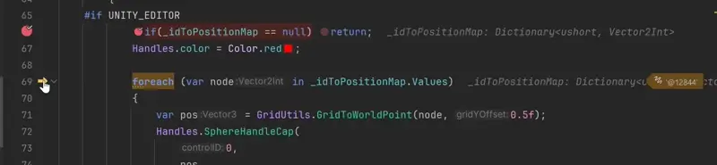
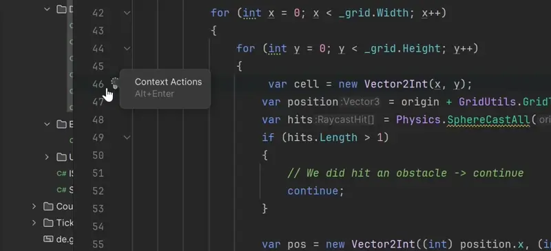
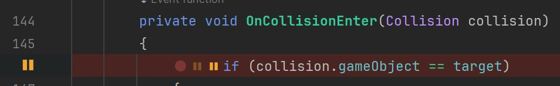
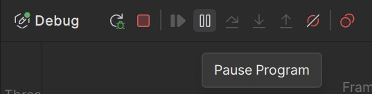
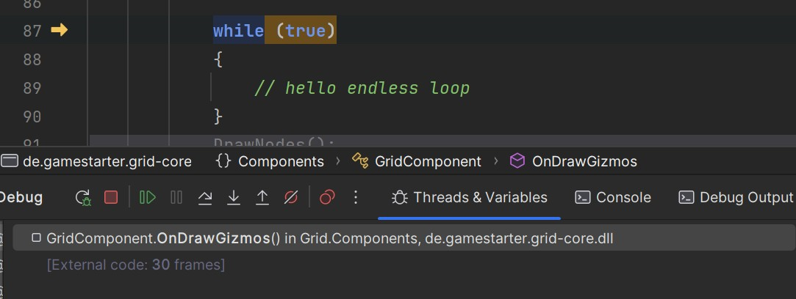
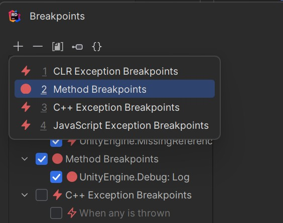
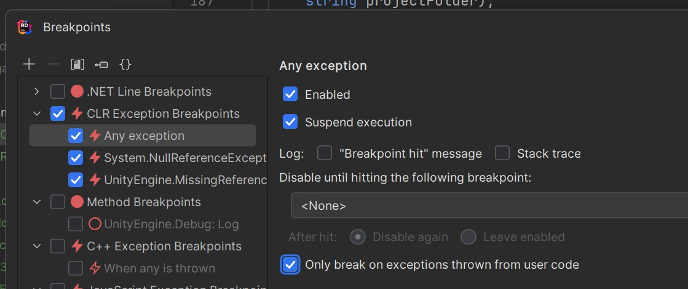

## Debugging: The Ultimate Skill for Sanity Preservation 🧠💥

Debugging isn’t just a skill; it’s an art. The difference between a seasoned dev and a junior often boils down to how fast they can pinpoint and obliterate bugs. A well-debugged game runs like a finely tuned spaceship; a poorly debugged one is a flaming wreck hurtling through the void of despair. 🌌🔥

In this guide, I’ll introduce you to the essential debugging tools in JetBrains Rider when working with Unity, then take you beyond the basics into *Debugger Mastery*. We’ll explore powerful techniques, best practices, and the kinds of tricks that make debugging feel like hacking the Matrix. 🕶️

---

## The Basic Debugging Tools 🛠️

### **1. Debug Window Button** 🖥️
Opens the Debug window, where you can inspect variables, breakpoints, threads, and the call stack.
*Think of it as your Mission Control Center.* 🚀

### **2. Stop Attach Unity Editor** 🛑
Detaches Rider from the Unity Editor without closing Unity itself.
*Useful when you’re done debugging but don’t want to reboot the universe.*

### **3. Resume Program (F9 / ⌘ + ⌥ + R)** ▶️
Continues execution after hitting a breakpoint.
*Perfect when you just want to let your game run free again... until the next breakpoint hits.*

### **4. Pause Program** ⏸️
Suspends execution at the current point so you can inspect what’s happening.
*Ideal when Unity is acting possessed, and you need to perform an exorcism.* 👻

### **5. Step Over (F10 / ⌘ + ⇧ + O)** 🔄
Moves to the next line without stepping into functions.
*Great when debugging loops but avoiding rabbit holes.* 🕳️

### **6. Step Into (F11 / ⌘ + ⇧ + I)** 🔍
Enters the function on the current line.
*Like diving deep into an unexplored dungeon.*

### **7. Step Out (⇧ + F11 / ⌘ + ⇧ + U)** 🏃
Exits the current function and returns to the caller.
*Useful when you realize you just stepped into a 500-line beast of a method by accident.*

### **8. View Breakpoints and Exceptions (Ctrl + Shift + F8 / ⌘ + ⇧ + F8)** 📌
Opens a window listing all active breakpoints and exception settings.
*Like having a map of all your traps and landmines.* 💣

### **9. Smart Step Into (Shift + F7 / ⌘ + ⇧ + F7)** 🧠
Lets you pick which function to step into when multiple are on the same line.
*No more getting dragged into irrelevant code like a side quest you didn’t ask for.*

### **10. Stack Trace Window** 🛤️
Shows the execution path, helping you understand how you got where you are.
*Because sometimes, retracing your steps is the only way to escape the debugging labyrinth.*

### **11. Evaluate Expression (Alt + F8 / ⌥ + F8)** 🧪
Lets you test and manipulate variable values on the fly.
*Ever wish you could just fix a bug without stopping the game? Welcome to the future.* 🚀 (well ... almost, you still need to fix it after you stopped debugging ¯\\_(ツ)_/¯ )

---

## Advanced Debugging Techniques 🧙‍♂️

### **Evaluate Expression: Debugging God Mode 👨‍💻**

Picture this: You’re hunting down an elusive bug, and suddenly realize you forgot to call `Init()` in your class. Normally, you’d stop, tweak the code, restart Unity, and reproduce the bug. Ugh. 😤

Not anymore! Just set a breakpoint, right-click anywhere in Rider, choose *Evaluate Expression*, and manually call `Init()` like a debugging deity. You can also tweak variables in real-time—flip a boolean, change a value, or even simulate a failed API call on the spot.

---

### **Dragging the Execution Pointer: Time Travel for Debuggers ⏳**

Meet the yellow arrow: your very own DeLorean for debugging. It shows which line of code is about to execute, but here’s the fun part—you can *drag it* to move execution forward or even back in time! 🚀

Ever stepped over a function too quickly and realized you missed something? No worries—just move the arrow back and step in again. It’s like having a Save/Load feature for your debugging process.

---

### **Conditional Breakpoints: Debug Like a Pro 🛑**

Ever wanted to break execution only when a variable meets a specific condition, like `x == 3 && y == 5`? That’s where conditional breakpoints come in.

Just create a breakpoint, right-click it, and add a condition. You’ll thank yourself when debugging a loop that runs a thousand times, but you only care about iteration 999. 🧠

---

### **Unity Pausepoints: When Code Isn’t Enough ⏯️**

Sometimes, you don’t need to break execution—you just want to *pause Unity itself*. This is handy for checking animations, physics, or UI at specific frames. Just add a *Unity Pausepoint* instead of a regular breakpoint!

---

## Debugging Tips & Tricks 🎩🐇

### **Rescue Your Game from an Infinite Loop 🔄🚨**

Ever had your game stuck in an endless loop, Unity frozen, and your only option was rage-quitting? Next time, attach the debugger, click *Pause Program*, and it will *teleport* you straight to the offending line of code. You can even move the execution pointer *outside the loop* and continue as if nothing happened. 🦸‍♂️

---

### **Method and Exception Breakpoints: Break Smarter, Not Harder ⚡**

Normally, breakpoints are tied to specific lines of code. But what if you want to break *whenever* a certain method is called, *anywhere* in the code? Enter **Method Breakpoints**!

Want to halt execution every time `Debug.Log()` is called? Just set a **Method Breakpoint** on `UnityEngine.Debug.Log()`, and boom—you’ve got eyes everywhere. 👀

Similarly, you can break execution whenever a **specific exception** is thrown—no need to manually trace logs. If you only want to keep your eyes on the code you can control and fix, don't forget to enable `Only break on exceptions thrown from user code`

---

### **Final Words** 🎤

Debugging isn’t just about fixing bugs; it’s about mastering your tools and bending Unity to your will. Rider gives you some of the best debugging capabilities out there—so use them, and soon you’ll be *that* dev who finds and fixes bugs before anyone else even notices them. 🚀

---

## **📚 References**

1️⃣ [JetBrains Rider: Breakpoints](https://www.jetbrains.com/help/rider/2024.1/Using_Breakpoints.html)  
2️⃣ [JetBrains Rider: Breakpoints Dialog](https://www.jetbrains.com/help/rider/2024.1/Breakpoints_dialog_Rider.html)  
3️⃣ [JetBrains Rider: Debugging](https://www.jetbrains.com/help/rider/2024.1/Debugging_Code.html)  
4️⃣ [JetBrains Rider: Exception Breakpoints](https://www.jetbrains.com/help/rider/2024.1/Debugging_Exceptions.html)  

